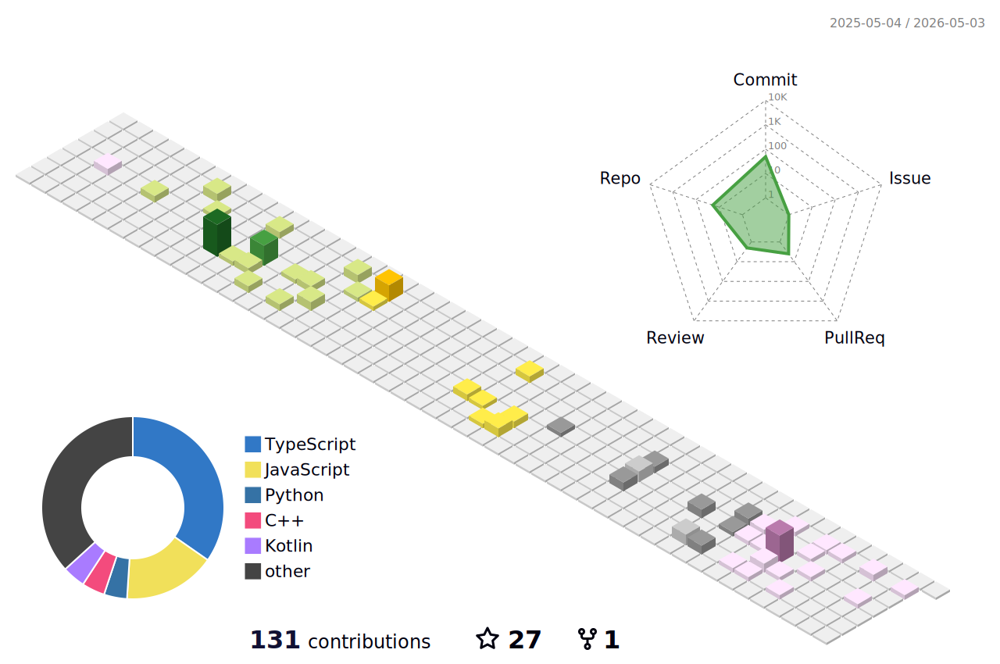

<!--
안녕하세요, dodokw님!
이 파일은 제공된 가이드를 기반으로 생성된 GitHub 프로필 README입니다.
아래 내용에서 '[ ]'로 표시된 부분이나 'your-...'로 시작하는 링크를 실제 정보로 수정해주세요.
-->

<!-- 1. 헤더: 방문자에게 첫인상을 남기는 부분입니다. -->

<!-- 'capsule-render'를 사용하여 동적인 헤더 이미지를 생성합니다. 텍스트나 색상을 자유롭게 변경해보세요. -->

<h3 align="center">👋 About Me</h3>

🔭 I’m currently working on a cross-platform mobile application using React Native and Expo.

🌱 I’m currently learning about native module bridging and performance optimization in mobile apps.

👯 I’m looking to collaborate on open-source projects related to the React Native ecosystem.

📫 How to reach me: [dodokw93@gmail.com]

⚡ Fun fact: I believe that a great user experience is as important as clean code.

<!-- 4. 기술 스택: 사용할 수 있는 기술들을 뱃지 형태로 보여줍니다. -->

<h3 align="center">🛠️ My Tech Stack 🛠️</h3>

<b>📱 Mobile & Frontend</b> 

 

<!-- 5. GitHub 통계: 자동으로 업데이트되는 활동 통계입니다. -->

<h3 align="center">📊 My GitHub Stats 📊</h3>

<!-- GitHub 활동 통계 카드 -->

<!-- 가장 많이 사용한 언어 카드 -->

<!-- 연속 커밋 기록 (Streak) 카드 -->

<!-- GitHub 프로필 트로피 -->

<!--
6. 3D 기여도 그래프:
이 이미지를 표시하려면 GitHub Action 설정이 필요합니다.
가이드 문서의 '파트 II, 섹션 2.2'를 참고하여 .github/workflows/profile-3d.yml 파일을 생성하고 Action을 실행해주세요.
Action이 성공적으로 실행되면 이 이미지가 자동으로 나타납니다.
-->

<h3 align="center">🔥 My Contribution Graph 🔥</h3>

