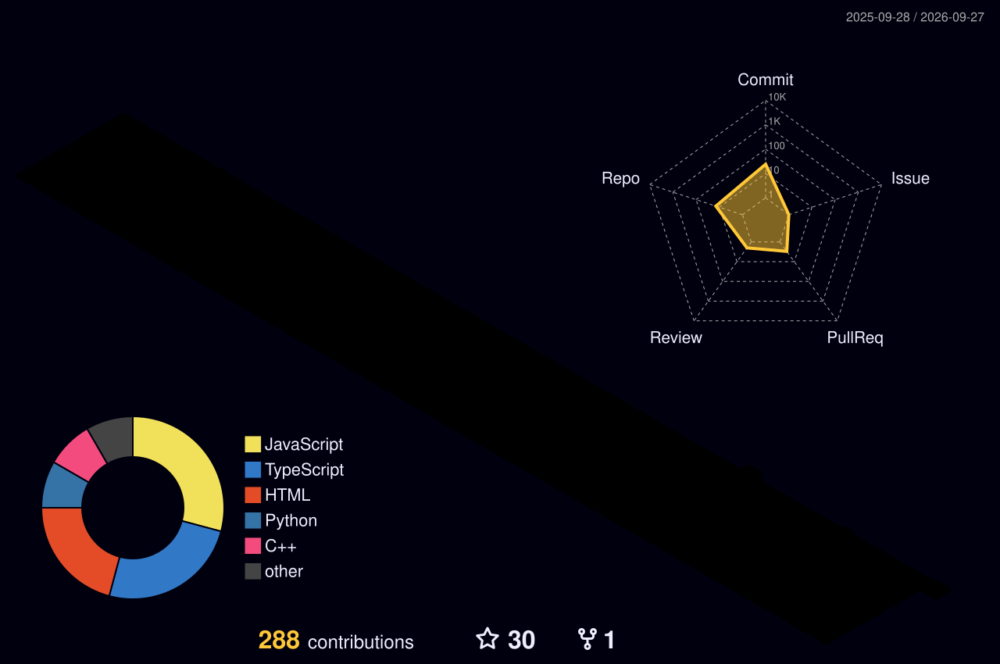

<!--
안녕하세요, dodokw님!
이 파일은 제공된 가이드를 기반으로 생성된 GitHub 프로필 README입니다.
아래 내용에서 '[ ]'로 표시된 부분이나 'your-...'로 시작하는 링크를 실제 정보로 수정해주세요.
-->
<!--

-->

## Hi, I'm DongKwan — founder of DOKWDO (도크도)

I build and operate DOKWDO's own mobile apps and web services, from product design and development to store releases and ongoing updates.

도크도는 자체 모바일 앱과 웹 서비스를 직접 기획·개발·출시하고 운영하는 독립 제품 스튜디오입니다.

- **Company & products:** [dokwdo.cloud](https://dokwdo.cloud)
- **Product development stories:** [DOKWDO portfolio](https://dokwdo.cloud/portfolio/)
- **Business contact:** [ceo@dokwdo.cloud](mailto:ceo@dokwdo.cloud)

### Products I build and operate

| Product | What it does |
| --- | --- |
| [HomeGym](https://hg.dokwdo.cloud/) | On-device AI workout coaching and exercise tracking |
| [ReVox](https://dokwdo.cloud/portfolio/#revox) | Song covers, recording and vocal effects |
| [챙김](https://dokwdo.cloud/portfolio/#chaenggim) | Housing, subsidy and welfare information discovery |
| [포근한 책친구](https://dokwdo.cloud/portfolio/#pogeuni) | Reading timers, a personal library and reading records |
| [mapAlbum](https://dokwdo.cloud/portfolio/#maps) | Exploring photo memories on a map |

I also work on open-source tools for the React Native ecosystem, including [react-native-nitro-tflite](https://github.com/dodokw/react-native-nitro-tflite).

 
<h3 align="center">🛠️ My Tech Stack 🛠️</h3>

<b>📱 Mobile & Frontend</b> 

 

 
<h3 align="center">📊 My GitHub Stats 📊</h3>
 

<h3 align="center">🔥 My Contribution Graph 🔥</h3>
 

