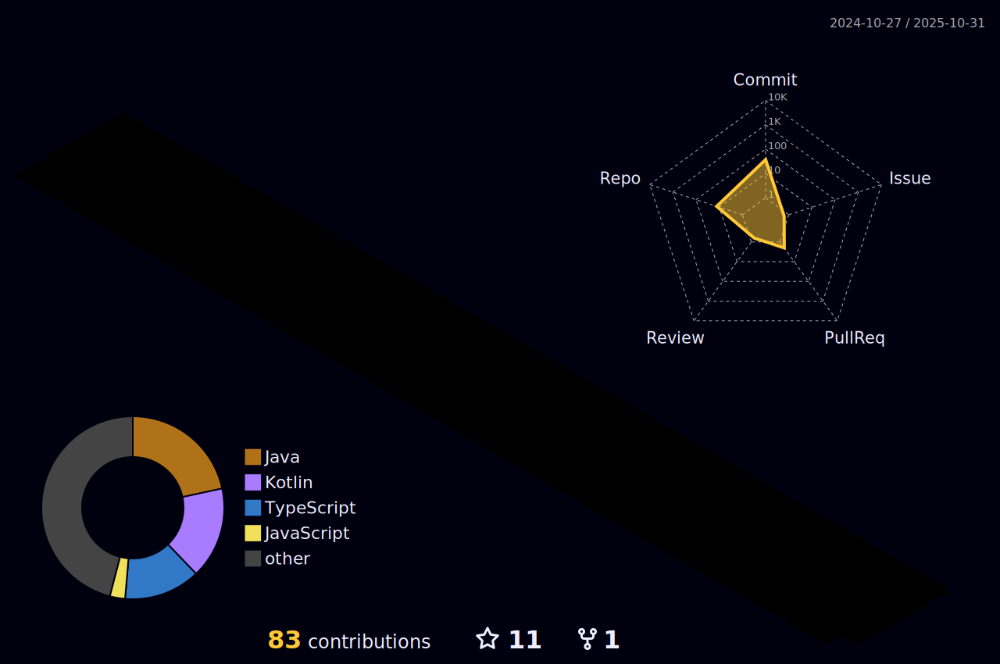

<!--
안녕하세요, dodokw님!
이 파일은 제공된 가이드를 기반으로 생성된 GitHub 프로필 README입니다.
아래 내용에서 '[ ]'로 표시된 부분이나 'your-...'로 시작하는 링크를 실제 정보로 수정해주세요.
-->
<!--

-->

<h3 align="flex-start">👋 About Me</h3>

🔭 I’m currently working on a cross-platform mobile application using React Native and Expo.

🌱 I’m currently learning about native module bridging and performance optimization in mobile apps.

👯 I’m looking to collaborate on open-source projects related to the React Native ecosystem.

📫 How to reach me: [dodokw93@gmail.com]

 
<h3 align="center">🛠️ My Tech Stack 🛠️</h3>

<b>📱 Mobile & Frontend</b> 

 

 
<h3 align="center">📊 My GitHub Stats 📊</h3>
 

<h3 align="center">🔥 My Contribution Graph 🔥</h3>
 

